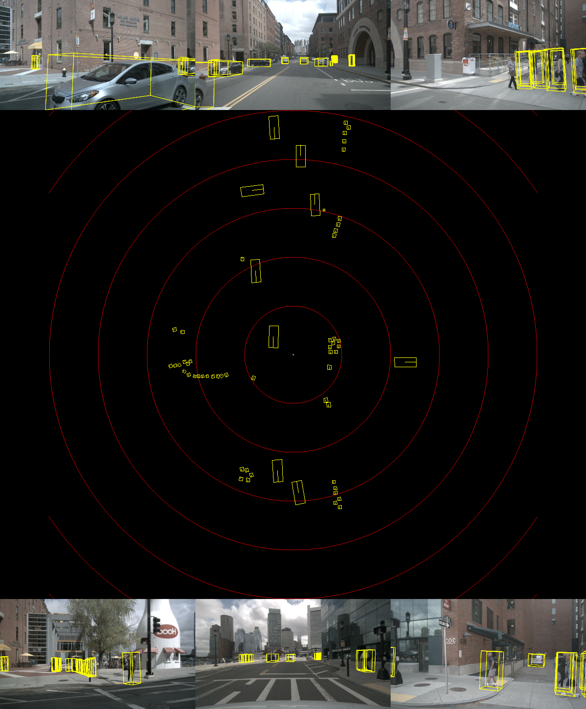

# FastBEV-ROS-TensorRT

This repository contains source code and models for FastBEV online real-time inference using CUDA, TensorRT & ROS, including ROS1 & ROS2.

+ reference [CUDA-FastBEV](https://github.com/Mandylove1993/CUDA-FastBEV)

  

